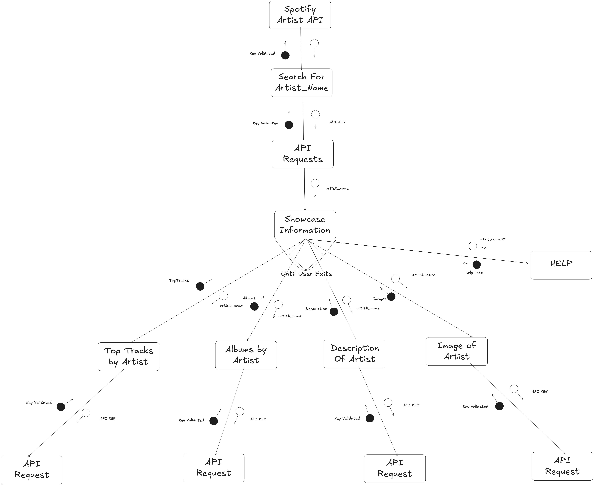
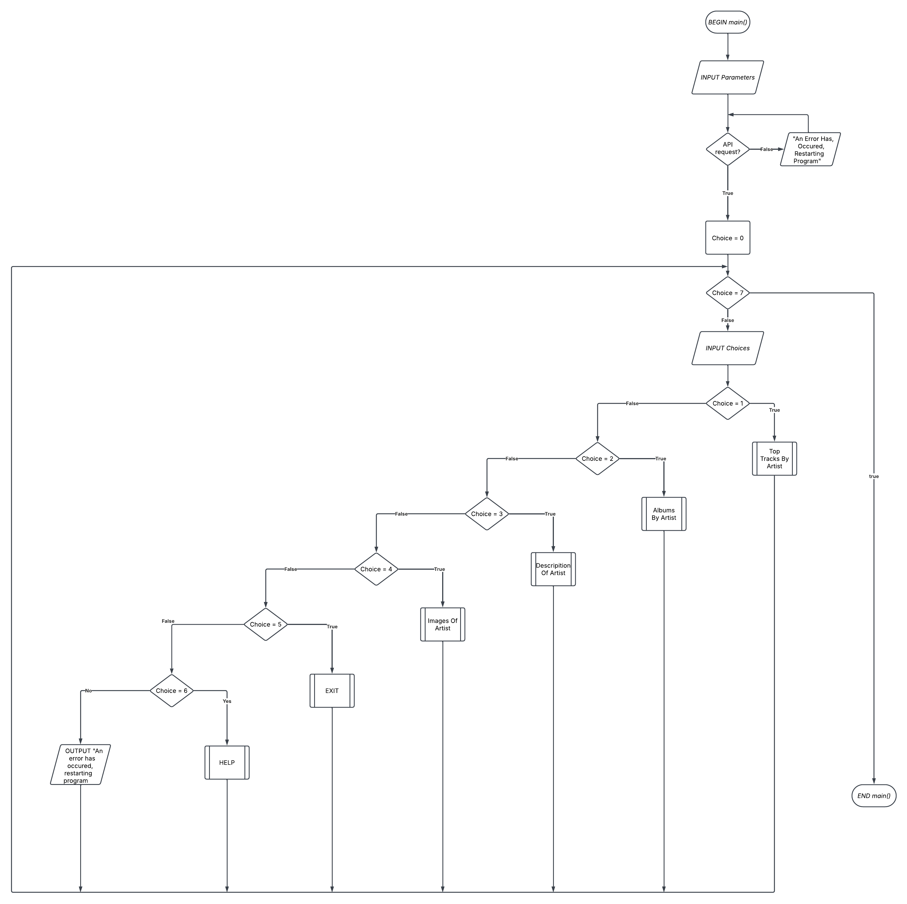
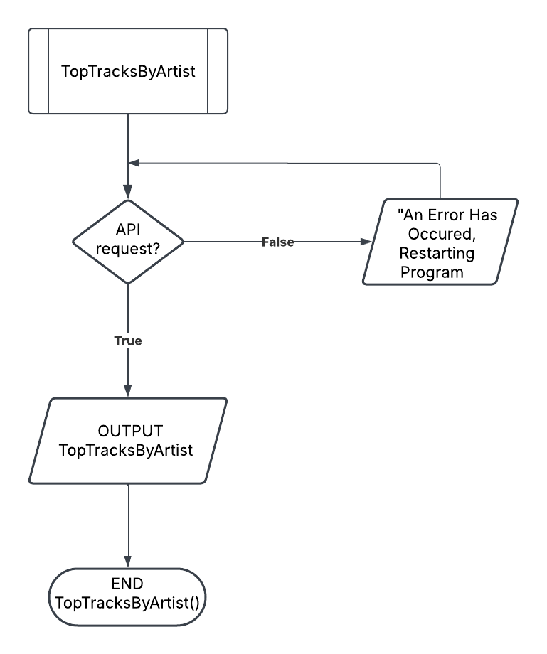
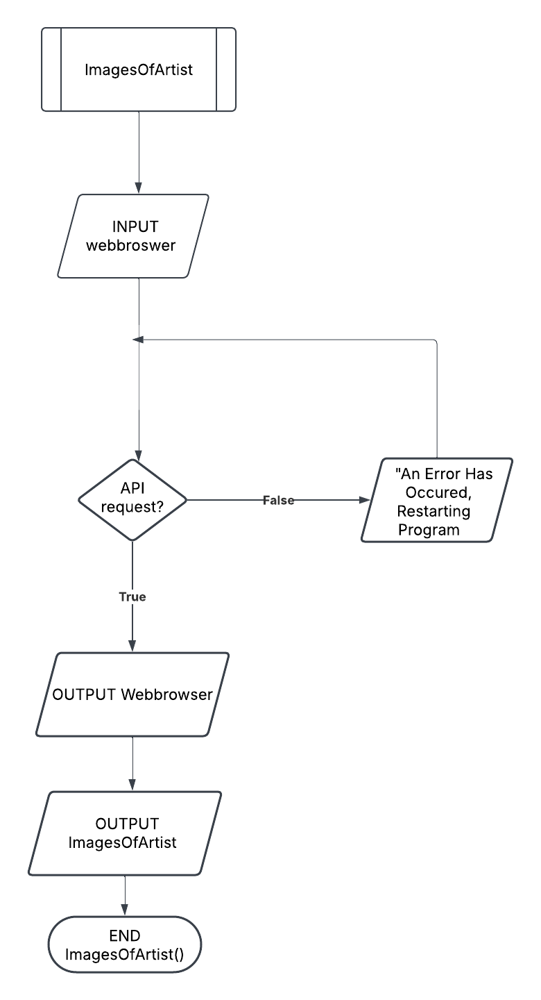

## Requirements Definition
---
## Functional requirements
--- 
### Data Retrival
    -The GUI/Program must be able to retrieve and transit Data to and from the computer and user
    -The GUI/Program must store the user info/data in a safe space where only the user and access and close
    -The GuI/Program must ensure that consent is allowed before used online for sponsering/marketing
### User Interface
    - The User Interface must be accessible to users only with permission. 
    - The User inferace must work and provide user with support when requested.
    -The GUI goal is to inform and provide the user with data whenever needed.
### Data Display
    - The Display must be readble and easy to understand. 
    - User should be allowed to choose options and provide feedback.
    - For disable people. accessibilty options may be change to support the user.
    -The Data must not be corrupted or tainted with a virus

## Non-Function Requirements
- - -
### Peformance
    - The system must be able to run smoothly
    - If there are issues in the User Interface, it must be fixed immedialty
    - The security of the User Interface must be Perfect, as if not secured could lead to potential breach and viruses
    - The User Interface must improve from user feedback to provide for users needs
    - The system must provide a variety of options to provide the needs of the user
### Reliabilty
    - The Data Provided on the User Interface must be  reliable and dated. This means the data is sourced with citations
    -The User Interface must always be avaible to user and should never be taken down unless malware takes over. If malware takes over, it should inform the user that there is an issue and should resume soon
### Usability and Accesibility
    -The layout of the User Interface must be easy for the user to navigate and understand
    -The User should be able to download the Data without consent
    -If the user needs support, The program should always provide help which the user can understand unless unavailiable
    -The User Interface should always state the rules before it can be used, this ensure the chance of being sued
    -The User Interface should be able to help disable people

## Determining Specifications
---
## Functional Specifications
--- 
### User Requirements
The user should easily be able to navigate the program. This statement only applies if the user is allowed access. The user should be allowed to manage and change the themes of GUI according to her prefrences. The user should also be allowed to choose according to their preferences

### Inputs and Outputs
The user be be able to input what data/information they are trying to find. In response the GUI should output the info back. The user should be able to press any button they want and the respective button should output it respective purpose

### Core Features
The main purpose of this GUI is to proivde users with finding data easily. Buttons and commands must be easy to navigate and should not redirect to a different route. It is critical that this GUI meets user request otherwise the GUI is faulty and should not continue. This Gui should be enjoyable and legible for the end-user to use and not be a mess.

### User Interaction
The Data is be viewed on a GUI. They can either press buttons or search from the bar. The GUI will have multiple features allowing the user to also ask for help and exit. The Gui will keep running until the User Extis

### Error Handling
The GUI should not crash and hand common errors gracefully. If there is an error it will restart the program and notify the devloper. There will be a help menu which will give suggestions/alternavtive to help resolves issues through the GUI. The developer should be aware of these issues so he can fix them to create a more enjoyable experience

## Non-Functional Specfications
---
### Performance
The GUI/program has to be effient in loading up and user-requests. The API must not output errors and only output the needs of the end-users. To ensure our GUI remains effienct, the GUI should always be updated and run to its latest version

### Useability/Accessibility
The GUI/program should be advertised and marketed to gather a bigger audience. The API should not be simple and should include many features so that the end-users have a wide range of options. The Program shouldn't crash/encounter errors. The developer and end-user should be able to access the GUI when needed. 

### Reliability
The GUI/program should always be updated to its latest version to lower to probability of the program encountering errors. The program should handle errors gracefully. The program should only be downloaded from a trustworthy publisher. The developer has to ensure that the GUI can run smoothly for the end-users

Actor: User(Preferably someone who wants to use the API)

Preconditions: Access to the internet and API (Spotify)

Main Flow:
1. Top tracks by artist - User enter an artist name; system retrieves and display top tracks by artist

2. Albums by artist - User enters an artist name; system retrieves and display albums by artist

3. Descripition of artist - User enters an artist name; system retrieves and display description of artist

4. Images of Artist - User enters an artist name; system retrieves and display images of artist

5. Exits – Exits the program

6. Help - Shows options to fix program

Postconditions: Spotify Artist data is retrieved, displayed and compared successfully.

## Design
---
## Gantt Chart
- - -


## Structure Chart
- - -


## Algorithms
- - -
### Main Algorithm


### SubRountine1 Algorithm(TopTracksByArtist)


### SubRountine2 Algorithm(ImagesOfArtist)


## PseudoCode
---
### Main Algorithm Pseudocode
```
BEGIN main()
    INPUT parameter
    IF API request is THEN
        choice=0
    Else
        "An error has occured restarting program"
        WHILE choice is not 8 THEN
            INPUT choice
            IF choice is 1 THEN
                TopTracksByArtist
            ELSEIF choice is 2 THEN
                AlbumsByArtist
            ELSEIF choice is 3 THEN
                DescriptionOfArtist
            ELSEIF choice is 4 THEN
                ImagesOfArtist
            ELSEIF choice is 5 Then
                EXIT
            ElseIF choice is 6 then
                HELP
            Else 
                OUTPUT "An error has occured restarting, program"
            ENDIF
        ENDWHILE
END main()    
``` 
### SubRountine2 Algorithm(TopTracksOfArtist)
```
BEGIN TopTracksByArtist()
    WHILE True
    IF API request is THEN
        OUTPUT TopTracksByArtist
    Else
        "An error has occured, restarting program"
        ENDIF
    ENDWHILE
END TopTracksByArtist()    
```
### SubRountine2 Algorithm(TopTracksOfArtist)
```
BEGIN ImagesOfArtist()
    INPUT Webbrowser
    WHILE True
    IF API request is THEN
        OUTPUT Webbrowser
        OUTPUT ImagesOfArtist
    Else
        "An error has occured, restarting program"
        ENDIF
    ENDWHILE
END main()    
``` 
## Data Dictionary
---
Variable|Data Type|Format for Display|Size in Bytes|Size for Display|Description|Example|Validation|
|---|---|---|---|---|---|---|---
|TopTracks|string, interger|N_xxx|200|50|Lists the Top Tracks of the Artist|1. Numb 2. In the End 3. Points of Authority |must be a valid string|
|Albums|string, interger|N_xxx|200|50|Lists All the albums uploaded by Artist|1. Hybrid Theory 2. Meteora 3. Minutes to Midnight|must be a valid string|
|Description|string, interger|xxxxxxx|100|2|Gives A brief Description of the artist|Linkin park is a Nu-metal, alternative-metal, pop band founded in 1998. They have an overall popularity of 90% and currently have 29496112 followers|must be a valid date and correct format|
|Images|string(URL), binary|URL format, Image|500|200|Gives the url and images of the artist||Must be either an image or string of url

## Testing and Debugging
---
### Intial commit/First commit (29/03/2025)
---
After problems with many API, i decided to try the spotify API. I went to https://developer.spotify.com/ and created an application so i could create an access token/ API key. I made a start on the UI by watching a youtube video https://www.youtube.com/watch?v=WAmEZBEeNmg&pp=ygUWaG93IHRvIHVzZSBzcG90aWZ5IGFwaQ%3D%3D which help me create an understanding on how to get access from the Spotify API.

### Second commit (30/03/2025)
---
i continue working on my code to obtain an access token/ API key from Spotify API. i created a seperate main.py called main1.py to test the UI (later deleted). i faced many challenged including typos and f strings, leading to my UI completely crashing. I was very hesitant and worried if the UI wouldn't work, leading me to overthink and research for other APIs  By the end of the day i had finished the UI for the access token/ API key from the Spotify API

### Third commit (30/03/2025)
---
After i was able to obtain an access token/ API key from Spotify API, i started working on my functions. I want my function to provide the end-user with information about a specific artist so i create the first two buttons. top tracks,  displaying the top ten tracks of the artist and Albums, displaying all top twenty (or less) albums created by the artist. I had change the main1.py to test.py where i would test the UI (later deleted) This commit was the first time were the code was readble and understandble in the terminal.

### Fourth commit (31/03/2025)
---
I felt that i need to create more functions so the end-user had more flexibilty while running the UI. Two more functions were created, Description, displaying a brief description of the genre, popularity and followers of the artist and Images, dislpaying the images of the Artist in different sizes. The Spofity Api didn't provide a description for the artist so i took subheading to create a description for the Artist. I also Made a start on the UI of the Terminal. My UI used "While" and "IF" to display the info in the terminal and create a function which would ask the user if they wanted to learn more about the artist

### Fifth commit (01/04/2025)
---
I felt like i had the potential to make a GUi and not be basic, so i did research and found out tkinter was the easiest application to make and GUI. I had to change each functions "IF" statement to "DEF" function so it could be layout in the GUI. i also create custom Fonts and used colours to customised my API to match Spotify. During this stage, i encountered a lot of problems with the display in the GUI, including buttons not showing up an the code crashing during the run-time. I Create a Button for Exiting and the GUI was finished by the end of the Day

### Six commit (02/04/2025)
---
After finsihing my GUI, i decided to do testing and debugging to find any errors which came up. I did a lot of customised and orgranised my code so it was legible. I also start to work on the comments on my GUI but decided i would do it later. I would start to redo my theory from here

### Seven commit(08/04/2025)
---
It is almost the due date of the assessment so i did some last minute check up. i add a help function which would display options for trying to reslove issues which may encounter while running the GUI. I also move the help button and exit button to the left side of the screen. i finish writing the comments and docstrings for the GUI
## Peer Evaluation
---
### Chris
Stephan's GUI had multiple features so that when you type in the artist name wrong it gives similier artist names. However the GUI screen could be further improved so that it won't be an eye sore to the users. The API that he used is unique as other people would not have thought of using it.

### Barry
Stephan's program works great, and looks visually appealing. It efficiently runs and functions as it's supposed to. Very useful in finding artists 10/10 would recommend

## Maintenance
---
My API wouldn't require much maintenance as Spotify has its own maintenance team but their would still be maintenance in my own GUI. If The Spotify API were to change overtime, i would occassionally check in with the https://developer.spotify.com/ webpage to ajdust my GUI with any issues. This is to ensure that my GUI is working effiently and perfectly, If the programs released new verison, i would ensure that all my functions and libraries were updated and worked. This is to ensure that the program doesn't crash when it is updated. If i found a bug in my GUI after deployment, i would announce that the GUI is under maintence and do some further research and debugging into why the program isn't running as intended. I would maintain clear documentation and ensure the program remains easy to update in the future by storing older version of the program and making it evident each time something is edited.
## Final Evaluation
---
I felt very proud and confident on how i work through this assessment task. I have created a Gui with many functions with its main goal to provide information for its end users. In relation to the waterfall approach, i took more of a river approach, doing one section then another section and redoing another section but towards the end i started doing the waterfall approach. Linking back to it functional and non functional requirements, i felt like the GUI achieved most of these requirements, but didn't address gaining feedback from end-users and accessibilty options for the disabled I felt like my time management for this assessment for this assessment task was oustanding as i didn't have to rush my work and felt like my work had potential. The only time my time managment was horrible was when i couldn't find an API which would work which left me far behind the class, right before i realised i didn't have much time. I had completed the theory and pratical of this assessment to the best of my potential, trying my hardest. Some problems i faced with my API was being able to generate a visual image inside the GUI and restricting the ability to write in the result box. I feel like my data dictionary and functional and non-functional specifications could be better but i am glad to have created such a program. This program has the potential to have on-going updates and improvements so that end-users can have a more enjoyable experience. At the same time this could lead to more threats and bugs but the GUI will be improved for the greater good of end-users

